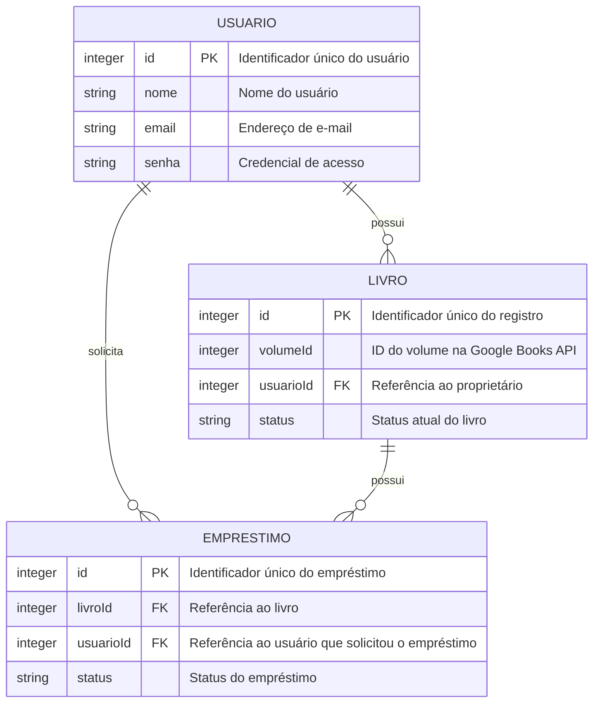

# 🛠️ Especificação Técnica (Tech Spec) - Biblioteca 364

Este documento descreve o modelo de dados da aplicação **Biblioteca 364**, responsável pelo gerenciamento de usuários, livros e empréstimos.

As informações bibliográficas dos livros, como título, autor, capa, gênero e descrição, serão obtidas através da **Google Books API**. Dessa forma, o banco de dados da aplicação armazenará apenas as informações necessárias para relacionar os livros aos seus proprietários e controlar os empréstimos.

---

## 1. Modelo de Dados (Diagrama ER)

Abaixo está o Diagrama Entidade-Relacionamento (DER) que representa a estrutura do Biblioteca 364.



---

## 2. Dicionário de Dados

### **Usuário**

Responsável por armazenar os dados necessários para a autenticação e identificação dos usuários do sistema.

* **id:** Identificador único do usuário.
* **nome:** Nome do usuário, podendo ser seu nome real ou um apelido.
* **email:** Endereço de e-mail utilizado para identificação e login.
* **senha:** Credencial utilizada para autenticação do usuário.

---

### **Livro**

Responsável por representar um exemplar pertencente a um usuário.

As informações bibliográficas não serão armazenadas diretamente no banco de dados. O sistema utilizará o `volumeId` para consultar os dados do livro diretamente na **Google Books API**.

* **id:** Identificador único do registro do livro no sistema.
* **volumeId:** Identificador do volume fornecido pela Google Books API. É utilizado para recuperar as informações bibliográficas do livro.
* **usuarioId:** Identificador do usuário proprietário do livro.

#### Exemplo

Um livro cadastrado no sistema poderá possuir os seguintes dados:

```json
{
    "id": "1",
    "volumeId": "zyTCAlFPjgYC",
    "usuarioId": "5"
}
```

A partir do `volumeId`, o sistema poderá consultar a Google Books API para obter informações como título, autor, capa, gênero e descrição.

---

### **Empréstimo**

Responsável por registrar as solicitações e empréstimos de livros entre os usuários.

* **id:** Identificador único do empréstimo.
* **livroId:** Identificador do livro que está sendo solicitado.
* **usuarioId:** Identificador do usuário que solicitou o empréstimo.
* **status:** Estado atual da solicitação.

Os possíveis estados são:

* **solicitado:** o usuário solicitou o livro e aguarda a resposta do proprietário;
* **emprestado:** o proprietário aceitou a solicitação e o livro está com o solicitante.

Quando um empréstimo for finalizado, o registro poderá ser removido ou atualizado de acordo com a implementação definida durante o desenvolvimento.

---

## 3. Versões das Tecnologias

* **HTML5**
* **CSS3**
* **JavaScript**
* **Google Books API**
* **Git**
* **GitHub**

### Tecnologias ainda não definidas

* **Framework CSS:** a definir.
* **Back-end:** a definir.
* **Banco de dados:** a definir.
